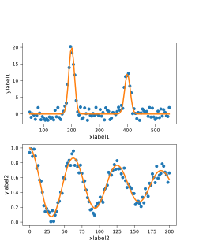
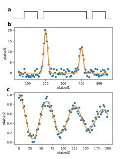
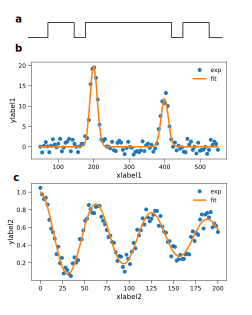

# mplinkfig

Make figures with matplotlib (https://matplotlib.org/) and inkscape (https://inkscape.org/)


[](https://pypi.org/project/mplinkfig)
[](https://pypi.org/project/mplinkfig)

-----

**Table of Contents**

- [Installation](#installation)
- [License](#license)
- [Exemple](#license)

## Installation

```console
pip install git+https://github.com/felix-cache/mplinkfig.git
```

## License

`mplinkfig` is distributed under the terms of the [MIT](https://spdx.org/licenses/MIT.html) license.


## Exemple

### Import packages
```console
import numpy as np
import matplotlib as mpl
import matplotlib.pyplot as plt
from mplinkfig import figunits, InkFig
```

### Change matplotlib settings
```console
mpl_params = {
        "text.usetex": False,
        "font.family": "sans-serif",
        "axes.labelsize": 7,
        "font.size": 7,
        "legend.fontsize": 6,
        "xtick.labelsize": 6,
        "ytick.labelsize": 6,
        "xtick.direction": 'out',
        "ytick.direction": 'out',
        "xtick.major.size" : 3.5,
        "ytick.major.size" : 3.5,
        "xtick.major.width" : .4,
        "ytick.major.width" : .4,
        "xtick.minor.size" : 2,
        "ytick.minor.size" : 2,
        "xtick.minor.width" : .4,
        "ytick.minor.width" : .4,
        "xtick.major.pad"  : 2,
        "ytick.major.pad"  : 2,
        "axes.labelpad"    : 2,
        'axes.linewidth' : .4,
        "axes.facecolor":  (1.0, 1.0, 1.0, 0)
}
mpl.rcParams.update(mpl_params)
```

### Data to plot
```console
x1 = np.linspace(50,550,100)
y1 = 12*np.exp(-.5*(x1-200)**2/100)+20*np.exp(-.5*(x1-400)**2/100)
x2 = np.linspace(0,200,100)
y2 = .5+np.cos(.2*x2)/2*np.exp(-x2/200)
```

### Create a new figure and define margins
```console
fw = 3.5 #figure width in inches
fig = plt.figure(figsize=(fw,fw/.8))

mw = .4 #margin width in inches
fig.subplots_adjust( #for the exemple we use the same width for the 4 margins
    hspace=0, wspace=0,
    left=figunits(mw,'x'),
    right=1-figunits(mw,'x'),
    bottom=figunits(mw,'y'),
    top=1-figunits(mw,'y'),
)
```

### Add a 200x200 grid to define plots location
```console
gs = fig.add_gridspec(200, 200)
```

### Plot the two datasets
```console
ax = fig.add_subplot(gs[20:100,:])
ax.plot(x1,y1+4*np.random.rand(100)-2,'.')
ax.plot(x1,y1)
ax.set_xlabel('xlabel1')
ax.set_ylabel('ylabel1')

ax = fig.add_subplot(gs[120:,:])
ax.plot(x2,y2+.2*np.random.rand(100)-.1,'.')
ax.plot(x2,y2)
ax.set_xlabel('xlabel2')
ax.set_ylabel('ylabel2')
```

### Save it using InkFig
```console
InkFig(fig, 'exemple.svg', show=True)
```


### After some modifications with inkscape


### Now we can modify the figure with mpl without loosing the modifications performed with inkscape
```console
fig = plt.figure(figsize=(fw,fw/.8))

fig.subplots_adjust(
    hspace=0, wspace=0,
    left=figunits(mw,'x'),
    right=1-figunits(mw,'x'),
    bottom=figunits(mw,'y'),
    top=1-figunits(mw,'y'),
)

ax = fig.add_subplot(gs[20:100,:])
ax.plot(x1,y1+4*np.random.rand(100)-2,'.',label='exp')
ax.plot(x1,y1,label='fit')
ax.set_xlabel('xlabel1')
ax.set_ylabel('ylabel1')
ax.legend(frameon=False)

ax = fig.add_subplot(gs[120:,:])
ax.plot(x2,y2+.2*np.random.rand(100)-.1,'.',label='exp')
ax.plot(x2,y2,label='fit')
ax.set_xlabel('xlabel2')
ax.set_ylabel('ylabel2')
ax.legend(frameon=False)

InkFig(fig,'exemple.svg', show=True)
```


We can restart these operations until we obtain the desired result.

Each time you run InkFig(fig,'path/filename.svg'), a copy of the previous version is saved in path/.filename. Above 20 executions the oldest versions are deleted.
